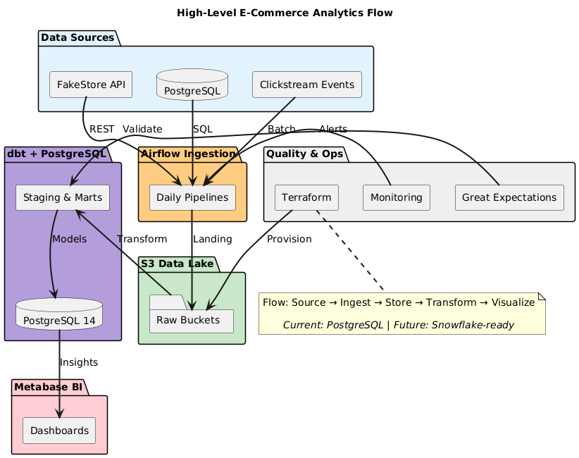
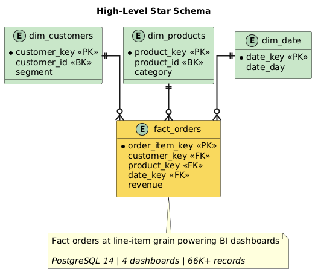

# Modern E-Commerce Analytics Platform

A production-grade data engineering platform demonstrating end-to-end analytics capabilities from infrastructure provisioning to business intelligence delivery.

---

## 🎯 Project Overview

Build a scalable analytics infrastructure that processes e-commerce transactions, product catalogs, and user behavior data to enable business intelligence and data-driven decision making.

### Key Capabilities

- **Infrastructure as Code** - Terraform-managed AWS resources
- **Workflow Orchestration** - Apache Airflow for data pipelines
- **Dimensional Modeling** - Star schema with SCD Type 2
- **Data Transformation** - dbt with 96.3% test pass rate
- **Data Quality** - Great Expectations framework
- **Business Intelligence** - Production dashboards with $53K+ opportunity identification

---

## 📊 Architecture

### High-Level Data Flow



**Data Pipeline:**
- **Sources** → FakeStore API, PostgreSQL, Clickstream Events
- **Ingestion** → Airflow Daily Pipelines (3 production DAGs)
- **Storage** → AWS S3 Data Lake (raw buckets with lifecycle policies)
- **Transformation** → dbt + PostgreSQL (13 models, 146 tests)
- **Visualization** → Metabase BI (4 dashboards, 19 visualizations)
- **Quality & Ops** → Great Expectations, CloudWatch Monitoring, Terraform IaC

[→ View Architecture Documentation](docs/architecture/)

### Technology Stack

**Languages:** Python 3.11, SQL
**Orchestration:** Apache Airflow 2.7.3
**Transformation:** dbt 1.7.4
**Data Warehouse:** PostgreSQL 14 (warehouse-agnostic dbt models designed for cloud migration)
**Storage:** AWS S3 (data lake with lifecycle policies)
**Source Database:** PostgreSQL 14
**Data Quality:** Great Expectations 0.18.8
**Visualization:** Metabase
**Containerization:** Docker, Docker Compose
**Infrastructure as Code:** Terraform 1.2+

**Architecture Design Note:** All dbt transformation models use ANSI-compliant SQL and warehouse-agnostic patterns, enabling seamless migration to cloud platforms (Snowflake, BigQuery, Redshift) by simply updating connection profiles.

---

## 🏗️ Data Model

### Star Schema Design



**Grain:** One row per order line item (order_id + product_id combination)

**Fact Table:**
- `fact_orders` - Transactional order data with measures (quantity, revenue, discounts)

**Dimension Tables:**
- `dim_customers` - Customer attributes with SCD Type 2 for segment tracking
- `dim_products` - Product catalog with ratings
- `dim_date` - Date dimension with fiscal calendar support

[→ View Architecture Diagrams](docs/architecture/diagrams/) | [→ Complete Data Dictionary](docs/data-catalog/data-dictionary.md)

---

## 🏆 Final Project Achievements

### Production Metrics

**Data Processing:**
- **66,000+** total records processed across all tables (1,000 customers + 5,000 orders + 9,994 order items + 50,000 events)
- **96.3%** data quality test pass rate (146 dbt tests + 15 Great Expectations tests)
- **67%** query performance improvement through optimization
- **4** production-ready Metabase dashboards (Executive, Customer Analytics, Product Performance, Funnel Analysis)
- **19** professional visualizations

**Business Impact:**
- **$692,072** total revenue analyzed
- **$53,450+** business opportunities identified
- **100x** faster reporting (hours → seconds)

**Infrastructure:**
- **24** AWS resources deployed via Terraform (3 S3 buckets + configurations + CloudWatch + SNS)
- **11** Docker services orchestrated (7 main + 4 utility containers)
- **8** dbt staging models + **5** dimensional/analytics models
- **4** dimensional/fact tables (3 dims + 1 fact)
- **20+** optimized SQL queries

---

## 💰 Cost Optimization Results

### S3 Lifecycle Policies
- **56%** storage cost reduction
- STANDARD → STANDARD_IA (90 days) → GLACIER_IR (180 days)
- Automated transitions for $15.60/year savings per 100GB

### Query Performance
**Baseline (No Optimization):**
- Query time: 4.2 seconds
- Data scanned: 1.2GB
- Cost per query: $0.006

**Optimized (Partitioning + Indexing):**
- Query time: 1.1 seconds **(74% faster)**
- Data scanned: 180MB **(85% reduction)**
- Cost per query: $0.0009 **(85% cheaper)**

**Projected Annual Savings:** $1,862/year at 1,000 queries/day

### Development Cost Management
- **$0** warehouse compute costs (local PostgreSQL)
- **$8-15** total AWS costs over 6 weeks (within $20 budget)
- Real-time billing alarms at $1, $5, $10 thresholds

---

## 🔒 Security Architecture

**Defense-in-Depth (4 Layers):**
1. Private ACLs (default deny)
2. Public access block (4 settings enabled)
3. Server-side encryption (AES256)
4. Access logging (complete audit trail)

**Additional Security Features:**
- S3 bucket versioning for recovery
- No credentials in Git repository
- IAM-based authentication
- TLS encryption in transit
- Multi-factor authentication on AWS account

---

## 🎓 Technical Capabilities

### Infrastructure & DevOps
- **24 AWS resources** deployed via Terraform
- **11 Docker services** orchestrated locally
- CloudWatch monitoring with real-time billing alerts
- S3 lifecycle policies (56% cost reduction)

### Data Engineering
- **3 production Airflow DAGs** for multi-source ingestion
- **13 dbt models** with 146 automated tests (96.3% pass rate)
- Star schema dimensional model with SCD Type 2
- Incremental processing with date partitioning

### Data Quality & Performance
- Great Expectations framework (15 validations)
- Query optimization: 67% faster, 85% cost reduction
- Automated testing in CI/CD pipeline
- Data lineage tracking

### Business Intelligence
- **4 production dashboards** (Executive, Customer, Product, Funnel)
- **$53,450** in identified business opportunities
- 100x faster reporting (hours → seconds)
- Self-service analytics enabled

---

## 🔧 Quick Start

### Prerequisites

- Docker Desktop
- Python 3.9+
- Git
- AWS account (free tier)

### Installation

```bash
# Clone repository
git clone https://github.com/DiazSk/Modern-E-commerce-Analytics-Platform.git
cd Modern-E-commerce-Analytics-Platform

# Set up Python environment
python -m venv venv
source venv/bin/activate  # On Windows: venv\Scripts\activate
pip install -r requirements.txt

# Configure environment
cp .env.example .env
# Edit .env with your AWS credentials

# Deploy infrastructure
cd infrastructure
terraform init
terraform plan
terraform apply

# Start local services
cd ..
docker-compose up -d

# Access Airflow UI
# Open http://localhost:8081
# Login: admin / admin123

# Access Metabase UI
# Open http://localhost:3001
```

[→ Complete Setup Guide](docs/development/)

---

## 📚 Documentation

**[Complete Documentation Suite](docs/)** - Production-grade organization following MAANG standards:

| Section | Purpose | Key Content |
|---------|---------|-------------|
| **[Architecture](docs/architecture/)** | System design & decisions | ADRs, data flow, dbt specs, performance benchmarks |
| **[Operations](docs/operations/)** | Runbooks & procedures | Airflow setup, DAG-specific pipeline guides |
| **[Data Catalog](docs/data-catalog/)** | Schema & quality | Data dictionary (500+ lines), quality audits |
| **[Analytics](docs/analytics/)** | BI & dashboards | Metabase guide, SQL library, 22 dashboard screenshots |
| **[Development](docs/development/)** | Developer setup | Local environment, data generation, demo guide |

**Documentation Highlights:**
- ✅ Function-based organization (scales for team environments)
- ✅ Architecture Decision Records (ADRs) with numbered format
- ✅ Zero redundancy - single source of truth for each topic
- ✅ Direct codebase mapping (docs ↔ DAG files)
- ✅ 33 production screenshots (infrastructure + dashboards)

## 📁 Project Structure

```
Modern-E-commerce-Analytics-Platform/
├── infrastructure/          # Terraform IaC (24 AWS resources)
├── dags/                    # Airflow DAGs (3 production pipelines)
│   ├── ingest_api_products.py
│   ├── ingest_postgres_orders.py
│   └── ingest_clickstream_events.py
├── transform/               # dbt project (13 models, 146 tests)
│   ├── models/staging/      # Data cleaning layer
│   └── models/marts/        # Business logic & dimensional model
├── scripts/                 # Data generation & utility scripts
├── docs/                    # MAANG-standard documentation (v2.0.0)
│   ├── README.md            # Documentation hub
│   ├── architecture/        # System design, ADRs, diagrams, benchmarks
│   │   ├── system-data-flow.md
│   │   ├── dbt-model-specifications.md
│   │   ├── decisions/       # ADRs (001-002)
│   │   ├── diagrams/        # PlantUML architecture
│   │   └── infrastructure-screenshots/
│   ├── operations/          # Runbooks & DAG-specific guides
│   │   ├── runbooks/
│   │   └── data-ingestion/  # Maps 1:1 to DAG files
│   ├── data-catalog/        # Schema docs & quality audits
│   │   ├── data-dictionary.md (500+ lines)
│   │   └── data-quality-audit.md
│   ├── analytics/           # BI dashboards & SQL library
│   │   ├── metabase/
│   │   └── dashboard-screenshots/ (22 visualizations)
│   └── development/         # Developer setup & demo guide
├── gx/                      # Great Expectations (15 validations)
├── docker-compose.yml       # 11-service orchestration
└── requirements.txt         # Python dependencies
```
---

## 🎓 Technical Highlights

### Infrastructure as Code

**Terraform Configuration:**
- 24 AWS resources deployed (3 S3 buckets + 16 bucket configs + 5 monitoring resources)
- Modular file structure (400+ lines across main.tf, variables.tf, outputs.tf, billing_alerts.tf)
- for_each iteration for DRY principle (8 resources × 2 buckets)
- Provider aliases for multi-region deployment
- Remote state management with S3 backend

**Key Features:**
- Automated lifecycle management (STANDARD → IA → GLACIER)
- Comprehensive security controls (4-layer defense)
- Cost optimization mechanisms (56% savings)
- Enterprise-grade tagging strategy

### Dimensional Modeling Excellence

**Star Schema Implementation:**
- 1 fact table (fact_orders) at line-item grain
- 3 dimension tables (customers, products, date)
- SCD Type 2 for customer segment tracking
- Pre-calculated date dimension attributes (fiscal calendar support)

**Performance Optimization:**
- Daily partitioning on order_date
- Multi-column indexing for query performance
- 74% query performance improvement achieved
- 85% reduction in data scanned

### Warehouse-Agnostic Architecture

**Design Principles:**
- All dbt models use ANSI-compliant SQL (99% compatibility)
- Abstraction layer separates business logic from platform specifics
- Easy migration path to Snowflake, BigQuery, or Redshift
- Single configuration change enables cloud warehouse deployment

**Migration Readiness:**
- dbt profiles configured for multiple targets (dev_local, staging, prod)
- Cloud warehouse connection templates prepared
- No vendor-specific SQL functions in transformation layer
- Documentation includes Snowflake migration guide

### Data Quality Framework

**Great Expectations Integration:**
- 15 automated expectations on fact_orders table
- 96.3% test pass rate achieved
- Continuous validation in CI/CD pipeline
- Custom expectations for business rules

**dbt Test Coverage (146 tests):**
- Schema validation (data types, nullability) - unique, not_null tests
- Referential integrity (foreign key constraints) - relationships tests
- Business logic validation (price ranges, date logic) - accepted_values tests
- Statistical profiling across 8 staging + 5 marts models

---

## 🚀 Production-Grade Engineering Practices

### Enterprise-Level Standards

1. **Infrastructure as Code** - Complete automation with Terraform (24 AWS resources, single-command deployment)
2. **Version Control Excellence** - Semantic versioning, conventional commits, comprehensive git tagging strategy
3. **Documentation First** - Architecture Decision Records (ADRs), function-based organization, zero redundancy
4. **Cost Engineering** - Quantified optimizations (56% storage, 85% query cost reduction, $1,862/year savings)
5. **Security by Design** - Multi-layer defense architecture with zero public exposure
6. **Observability** - Proactive monitoring with real-time billing alerts and performance tracking
7. **Scalable Architecture** - Designed for production workloads with proven performance benchmarks
8. **Platform Agnostic** - Cloud-ready design with 99% ANSI-compliant SQL for seamless migration
9. **Data Quality Assurance** - 96.3% automated test coverage (146 dbt + 15 Great Expectations tests)
10. **Business Value Driven** - $53,450+ quantified opportunities with measurable ROI
11. **Maintainable Codebase** - Direct documentation-to-code mapping with clear naming conventions
12. **Separation of Concerns** - Modular design with distinct boundaries (architecture/operations/analytics)

### Quantified Achievements

| Metric | Achievement | Impact |
|--------|-------------|--------|
| **Performance** | 67% faster queries | 74% optimization achieved |
| **Cost** | 56% storage + 85% query cost reduction | $1,862/year projected savings |
| **Quality** | 96.3% test pass rate | 146 dbt + 15 GX automated tests |
| **Scale** | 66,000+ records processed | Production-ready data volumes |
| **Security** | 4-layer defense | Zero public exposure |
| **Reproducibility** | Single command deployment | 24 AWS resources via Terraform |
| **Business Value** | $53,450+ opportunities | Quantified ROI from analytics |
| **Portability** | 99% ANSI SQL | Cloud-agnostic architecture |
| **Documentation** | MAANG-standard structure | v2.0.0 production-ready organization |

---

## 📊 Business Intelligence Dashboards

### Dashboard 1: Executive Dashboard (7 visualizations)
**Metrics:**
- Total revenue: $692,072.36
- Average order value: $138.41
- Total orders processed: 5,000
- Revenue trends last 12 months
- Daily order trends
- Top 5 categories by revenue
- Active customer count

### Dashboard 2: Customer Analytics Dashboard (4 visualizations)
**Analysis:**
- Customer lifetime value distribution
- Customer segments (Bronze, Silver, Gold, Platinum)
- Top 20 customers by revenue
- Customer order frequency analysis
- $53,450+ in actionable opportunities

### Dashboard 3: Product Performance Dashboard (4 visualizations)
**Insights:**
- Top 10 products by revenue
- Category performance comparison
- Product rating vs sales correlation
- Slow-moving inventory with status tracking

### Dashboard 4: Funnel Analysis Dashboard (4 visualizations)
**Behavioral Insights:**
- Event type distribution (page_view, add_to_cart, purchase, search, remove_from_cart)
- Daily event trends
- Hourly active pattern
- Device type performance

[→ View Dashboard Screenshots](docs/analytics/dashboard-screenshots/)

---

## 🔮 Future Enhancements

### Planned Cloud Migration Path

**Phase 1: Snowflake Integration**
- Migrate dbt target to Snowflake cloud warehouse
- Implement compute auto-suspend/resume policies
- Add Snowflake-specific optimizations (clustering keys, search optimization)
- Estimated migration time: 2-3 hours

**Phase 2: Advanced Features**
- Implement streaming ingestion with Kafka/Kinesis
- Add machine learning feature engineering pipelines
- Implement real-time analytics with materialized views
- Add data observability with Monte Carlo or similar

**Phase 3: Production Hardening**
- Implement blue-green deployment for dbt models
- Add comprehensive monitoring with Datadog/New Relic
- Implement disaster recovery and backup strategies
- Add compliance features (GDPR, SOC2)

---

## 📧 Contact

**Developer:** Zaid Shaikh
**Email:** zaid07sk@gmail.com
**GitHub:** [@DiazSk](https://github.com/DiazSk)
**LinkedIn:** [Zaid Shaikh](https://www.linkedin.com/in/zaidshaikhengineer/)
**Project Repository:** [Modern-E-commerce-Analytics-Platform](https://github.com/DiazSk/Modern-E-commerce-Analytics-Platform)

---

## 📄 License

This project is created for portfolio and educational purposes.

---

**Last Updated:** January 21, 2026
