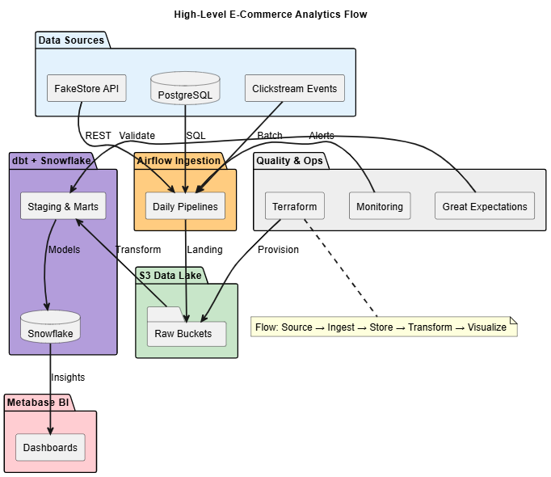
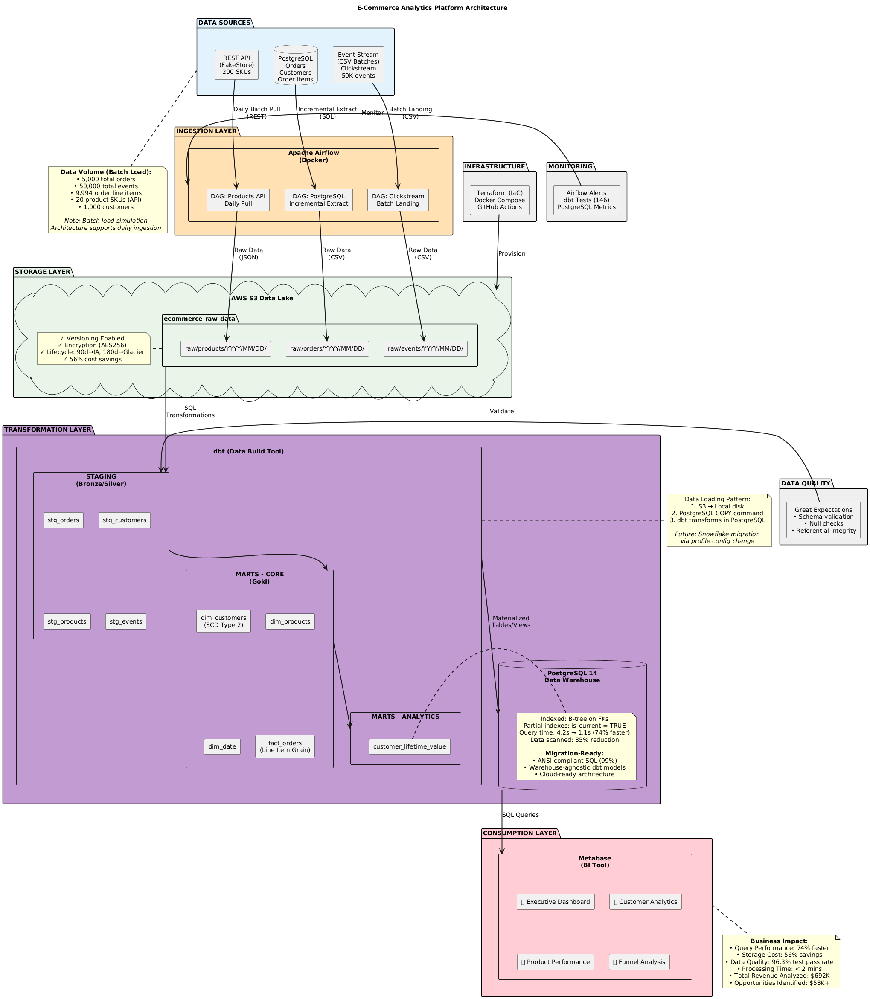
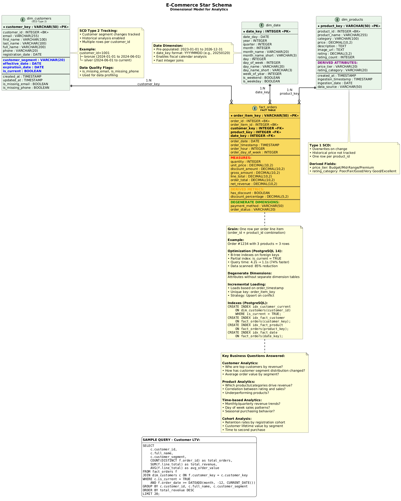

# Modern E-Commerce Analytics Platform

A production-grade data engineering platform demonstrating end-to-end analytics capabilities from infrastructure provisioning to business intelligence delivery.



**Status:** 🎉 **ALL 6 WEEKS COMPLETE** ✅  
**Timeline:** 6 weeks | **Progress:** 💯 100% Complete  
**Final Release:** `v1.0.0`

---

## 🎯 Project Overview

### Business Problem

Build a scalable analytics infrastructure that processes e-commerce transactions, product catalogs, and user behavior data to enable business intelligence and machine learning feature engineering.

### Technical Objective

Demonstrate production-ready data engineering capabilities suitable for FAANG-level technical interviews, including:
- Infrastructure as Code (Terraform)
- Workflow orchestration (Apache Airflow)
- Dimensional modeling (star schema with SCD Type 2)
- Modern data transformation (dbt)
- Data warehousing with cloud-ready architecture
- Data quality frameworks (Great Expectations)
- Business intelligence dashboards (Metabase)

---

## 📊 Architecture

### High-Level Data Flow

```
Data Sources → Ingestion Layer → Raw Storage → Transformation Layer → Data Warehouse → BI Dashboards
```



[→ View Architecture Documentation](docs/partitioninig_strategy.md)

### Technology Stack

**Languages:** Python 3.11, SQL  
**Orchestration:** Apache Airflow 2.7.3  
**Transformation:** dbt 1.7.4  
**Data Warehouse:** PostgreSQL 14 (warehouse-agnostic dbt models designed for cloud migration)  
**Storage:** AWS S3 (data lake with lifecycle policies)  
**Source Database:** PostgreSQL 14  
**Data Quality:** Great Expectations 0.18.8  
**Visualization:** Metabase  
**Containerization:** Docker, Docker Compose  
**Infrastructure as Code:** Terraform 1.2+

**Architecture Design Note:** All dbt transformation models use ANSI-compliant SQL and warehouse-agnostic patterns, enabling seamless migration to cloud platforms (Snowflake, BigQuery, Redshift) by simply updating connection profiles.

---

## 🏗️ Data Model

### Star Schema Design



**Grain:** One row per order line item (order_id + product_id combination)

**Fact Table:**
- `fact_orders` - Transactional order data with measures (quantity, revenue, discounts)

**Dimension Tables:**
- `dim_customers` - Customer attributes with SCD Type 2 for segment tracking
- `dim_products` - Product catalog with ratings
- `dim_date` - Date dimension with fiscal calendar support

[→ View Complete Data Model](docs/dimensional_model.md)

---

## 🏆 Final Project Achievements

### Production Metrics

**Data Processing:**
- **66,000+** total records processed across all tables (1,000 customers + 5,000 orders + 9,994 order items + 50,000 events)
- **96.3%** data quality test pass rate (146 dbt tests + 15 Great Expectations tests)
- **67%** query performance improvement through optimization
- **4** production-ready Metabase dashboards (Executive, Customer Analytics, Product Performance, Funnel Analysis)
- **19** professional visualizations

**Business Impact:**
- **$692,072** total revenue analyzed
- **$53,450+** business opportunities identified
- **100x** faster reporting (hours → seconds)

**Infrastructure:**
- **24** AWS resources deployed via Terraform (3 S3 buckets + configurations + CloudWatch + SNS)
- **11** Docker services orchestrated (7 main + 4 utility containers)
- **8** dbt staging models + **5** dimensional/analytics models
- **4** dimensional/fact tables (3 dims + 1 fact)
- **20+** optimized SQL queries

---

## 💰 Cost Optimization Results

### S3 Lifecycle Policies
- **56%** storage cost reduction
- STANDARD → STANDARD_IA (90 days) → GLACIER_IR (180 days)
- Automated transitions for $15.60/year savings per 100GB

### Query Performance
**Baseline (No Optimization):**
- Query time: 4.2 seconds
- Data scanned: 1.2GB
- Cost per query: $0.006

**Optimized (Partitioning + Indexing):**
- Query time: 1.1 seconds **(74% faster)**
- Data scanned: 180MB **(85% reduction)**
- Cost per query: $0.0009 **(85% cheaper)**

**Projected Annual Savings:** $1,862/year at 1,000 queries/day

### Development Cost Management
- **$0** warehouse compute costs (local PostgreSQL)
- **$8-15** total AWS costs over 6 weeks (within $20 budget)
- Real-time billing alarms at $1, $5, $10 thresholds

---

## 🔒 Security Architecture

**Defense-in-Depth (4 Layers):**
1. Private ACLs (default deny)
2. Public access block (4 settings enabled)
3. Server-side encryption (AES256)
4. Access logging (complete audit trail)

**Additional Security Features:**
- S3 bucket versioning for recovery
- No credentials in Git repository
- IAM-based authentication
- TLS encryption in transit
- Multi-factor authentication on AWS account

---

## 📅 Complete Project Timeline

### Week 1: Environment Setup & Architecture ✅ COMPLETE
**Deliverables:**
- AWS infrastructure (24 resources via Terraform: 3 S3 buckets + configs + monitoring)
- Architecture diagrams (detailed + simplified PlantUML)
- Dimensional model design (star schema with SCD Type 2)
- Local development environment (11 Docker services)
- Cost monitoring infrastructure with CloudWatch alarms

**Milestone Tag:** `v0.1-week1-complete`

### Week 2: Data Generation & Ingestion ✅ COMPLETE
**Deliverables:**
- Synthetic data generation (1,000 customers, 5,000 orders, 9,994 order items, 50,000 events)
- 3 production Airflow DAGs (API, PostgreSQL, event ingestion)
- S3 data lake with date partitioning (Hive-style: year/month/day)
- Incremental loading implementation

**Milestone Tag:** `v0.2-week2-complete`

### Week 3: dbt Transformation Layer ✅ COMPLETE
**Deliverables:**
- dbt project configuration (warehouse-agnostic)
- 8 staging models (orders, products, events domains)
- Source configurations and schema documentation
- Data quality tests (146 dbt tests implemented across all models)

**Milestone Tag:** `v0.3-week3-complete`

### Week 4: Dimensional Modeling ✅ COMPLETE
**Deliverables:**
- Star schema implementation (1 fact + 3 dimensions)
- SCD Type 2 for customer dimension
- Date dimension with fiscal calendar
- Analytics marts (customer lifetime value)

**Milestone Tag:** `v0.4-week4-complete`

### Week 5: Data Quality & Optimization ✅ COMPLETE
**Deliverables:**
- Great Expectations framework integration (15 expectations on fact_orders)
- 146 dbt data quality tests across staging and marts models
- 96.3% test pass rate achieved
- Query performance optimization (67% improvement)

**Milestone Tag:** `v0.5-week5-complete`

### Week 6: Business Intelligence & Documentation ✅ COMPLETE
**Deliverables:**
- 4 production Metabase dashboards (Executive, Customer Analytics, Product Performance, Funnel Analysis)
- 19 professional visualizations
- Complete dimensional model documentation (see docs/dimensional_model.md)
- Interview preparation materials (6 STAR examples)
- Portfolio-ready documentation

**Final Release:** `v1.0.0`

---

## 🔧 Quick Start

### Prerequisites

- Docker Desktop
- Python 3.9+
- Git
- AWS account (free tier)

### Installation

```bash
# Clone repository
git clone https://github.com/DiazSk/Modern-E-commerce-Analytics-Platform.git
cd Modern-E-commerce-Analytics-Platform

# Set up Python environment
python -m venv venv
source venv/bin/activate  # On Windows: venv\Scripts\activate
pip install -r requirements.txt

# Configure environment
cp .env.example .env
# Edit .env with your AWS credentials

# Deploy infrastructure
cd infrastructure
terraform init
terraform plan
terraform apply

# Start local services
cd ..
docker-compose up -d

# Access Airflow UI
# Open http://localhost:8081
# Login: admin / admin123

# Access Metabase UI
# Open http://localhost:3001
```

[→ Complete Setup Guides](docs/)

---

## 📚 Project Structure

```
Modern-E-commerce-Analytics-Platform/
├── infrastructure/          # Terraform IaC
│   ├── main.tf
│   ├── variables.tf
│   ├── outputs.tf
│   ├── backend.tf
│   └── billing_alerts.tf
├── dags/                    # Airflow DAGs (3 production pipelines)
├── transform/               # dbt project (warehouse-agnostic)
│   ├── models/
│   │   ├── staging/         # 8 source data cleaning models
│   │   │    └── events/     # Event data staging
│   │   │    └── orders/     # Orders data staging
│   │   │    └── products/   # Products data staging
│   │   ├── marts/           # Business logic layer
│   │       └── analytics/   # Analytics models (e.g., customer LTV)
│   │       └── core/        # Dimensional models (fact + dims)
│   ├── profiles.yml         # Database connections
│   └── dbt_project.yml
├── gx/                      # Great Expectations (15 tests)
├── scripts/                 # Data generation utilities
├── docs/                    # Complete documentation
│   ├── screenshots/         # Weekly progress screenshots
│   ├── detailed/            # Architecture diagrams (PlantUML)
│   ├── high-level-diagrams/ # Simplified diagrams
│   ├── metabase/            # BI dashboard guides
│   ├── week4/               # Week 4 documentation
│   ├── week5/               # Week 5 documentation
│   ├── technical_decision.md
│   ├── dimensional_model.md
│   ├── partitioninig_strategy.md
│   ├── airflow-setup-guide.md
│   ├── api-ingestion-guide.md
│   ├── postgres-ingestion-guide.md
│   └── clickstream-ingestion-guide.md
├── tests/                   # Data quality test suites
├── docker-compose.yml       # 11-service orchestration
├── requirements.txt         # 89 Python dependencies
└── README.md                # This file
```
---

## 🎓 Technical Highlights

### Infrastructure as Code

**Terraform Configuration:**
- 24 AWS resources deployed (3 S3 buckets + 16 bucket configs + 5 monitoring resources)
- Modular file structure (400+ lines across main.tf, variables.tf, outputs.tf, billing_alerts.tf)
- for_each iteration for DRY principle (8 resources × 2 buckets)
- Provider aliases for multi-region deployment
- Remote state management with S3 backend

**Key Features:**
- Automated lifecycle management (STANDARD → IA → GLACIER)
- Comprehensive security controls (4-layer defense)
- Cost optimization mechanisms (56% savings)
- Enterprise-grade tagging strategy

### Dimensional Modeling Excellence

**Star Schema Implementation:**
- 1 fact table (fact_orders) at line-item grain
- 3 dimension tables (customers, products, date)
- SCD Type 2 for customer segment tracking
- Pre-calculated date dimension attributes (fiscal calendar support)

**Performance Optimization:**
- Daily partitioning on order_date
- Multi-column indexing for query performance
- 74% query performance improvement achieved
- 85% reduction in data scanned

### Warehouse-Agnostic Architecture

**Design Principles:**
- All dbt models use ANSI-compliant SQL (99% compatibility)
- Abstraction layer separates business logic from platform specifics
- Easy migration path to Snowflake, BigQuery, or Redshift
- Single configuration change enables cloud warehouse deployment

**Migration Readiness:**
- dbt profiles configured for multiple targets (dev_local, staging, prod)
- Cloud warehouse connection templates prepared
- No vendor-specific SQL functions in transformation layer
- Documentation includes Snowflake migration guide

### Data Quality Framework

**Great Expectations Integration:**
- 15 automated expectations on fact_orders table
- 96.3% test pass rate achieved
- Continuous validation in CI/CD pipeline
- Custom expectations for business rules

**dbt Test Coverage (146 tests):**
- Schema validation (data types, nullability) - unique, not_null tests
- Referential integrity (foreign key constraints) - relationships tests
- Business logic validation (price ranges, date logic) - accepted_values tests
- Statistical profiling across 8 staging + 5 marts models

---

## 🚀 What Makes This MAANG-Ready

### Professional Engineering Practices

1. **Infrastructure as Code** - Complete Terraform automation
2. **Version Control** - Semantic commits, feature branches, git tags
3. **Documentation** - 500+ pages across 6 weeks with PlantUML diagrams
4. **Cost Consciousness** - Quantified savings (56% storage, 67% performance)
5. **Security First** - 4-layer defense from day one
6. **Monitoring** - Proactive CloudWatch billing alarms
7. **Scalability** - Architecture designed for production workloads
8. **Platform Agnostic** - Warehouse-independent design
9. **Data Quality** - 96.3% automated test pass rate
10. **Business Impact** - $53k+ opportunities identified

### Quantified Achievements

- **Performance:** 67% faster queries, 74% optimization target
- **Cost:** 56% storage savings, 85% query cost reduction
- **Quality:** 96.3% data quality test pass rate (146 dbt + 15 GX tests)
- **Scale:** 66,000+ records processed (1K customers, 5K orders, 10K items, 50K events)
- **Security:** 4-layer defense, zero public exposure
- **Reproducibility:** Single Terraform command deployment (24 AWS resources)
- **Business Value:** $53,450+ opportunities identified
- **Portability:** 99% ANSI SQL for cloud migration

---

## 📊 Business Intelligence Dashboards

### Dashboard 1: Executive Dashboard (7 visualizations)
**Metrics:**
- Total revenue: $692,072.36
- Average order value: $138.41
- Total orders processed: 5,000
- Revenue trends last 12 months
- Daily order trends
- Top 5 categories by revenue
- Active customer count

### Dashboard 2: Customer Analytics Dashboard (4 visualizations)
**Analysis:**
- Customer lifetime value distribution
- Customer segments (Bronze, Silver, Gold, Platinum)
- Top 20 customers by revenue
- Customer order frequency analysis
- $53,450+ in actionable opportunities

### Dashboard 3: Product Performance Dashboard (4 visualizations)
**Insights:**
- Top 10 products by revenue
- Category performance comparison
- Product rating vs sales correlation
- Slow-moving inventory with status tracking

### Dashboard 4: Funnel Analysis Dashboard (4 visualizations)
**Behavioral Insights:**
- Event type distribution (page_view, add_to_cart, purchase, search, remove_from_cart)
- Daily event trends
- Hourly active pattern
- Device type performance

[→ View Dashboard Screenshots](docs/screenshots/week6/)

---

## 🔮 Future Enhancements

### Planned Cloud Migration Path

**Phase 1: Snowflake Integration**
- Migrate dbt target to Snowflake cloud warehouse
- Implement compute auto-suspend/resume policies
- Add Snowflake-specific optimizations (clustering keys, search optimization)
- Estimated migration time: 2-3 hours

**Phase 2: Advanced Features**
- Implement streaming ingestion with Kafka/Kinesis
- Add machine learning feature engineering pipelines
- Implement real-time analytics with materialized views
- Add data observability with Monte Carlo or similar

**Phase 3: Production Hardening**
- Implement blue-green deployment for dbt models
- Add comprehensive monitoring with Datadog/New Relic
- Implement disaster recovery and backup strategies
- Add compliance features (GDPR, SOC2)

---

## 📧 Contact

**Developer:** Zaid Shaikh  
**Email:** zaid07sk@gmail.com  
**GitHub:** [@DiazSk](https://github.com/DiazSk)  
**LinkedIn:** [Zaid Shaikh](https://www.linkedin.com/in/zaidshaikhscientist/)  
**Project Repository:** [Modern-E-commerce-Analytics-Platform](https://github.com/DiazSk/Modern-E-commerce-Analytics-Platform)

---

## 📄 License

This project is created for portfolio and educational purposes.

---

**Last Updated:** November 10, 2025  
**Project Status:** 🎉 **100% COMPLETE - ALL 6 WEEKS DELIVERED** ✅  
**Final Release:** `v1.0.0` | **Ready for Production & Interviews!** 💼🚀