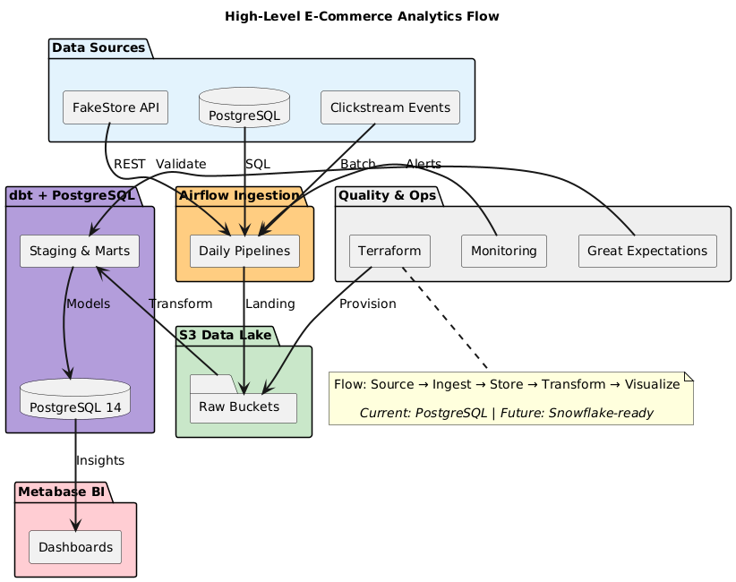
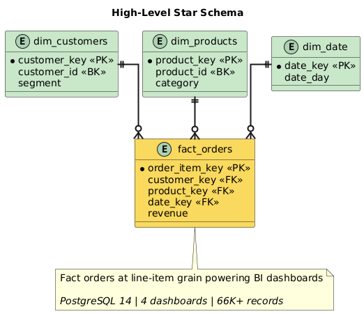

# Modern E-Commerce Analytics Platform

[](https://github.com/DiazSk/Modern-E-commerce-Analytics-Platform/actions/workflows/ci.yml)

An end-to-end batch analytics pipeline for e-commerce data: Airflow ingests orders, products and clickstream events into an S3 data lake and Postgres, dbt models them into a star schema with SCD Type 2 customer history, and Metabase serves the dashboards.

## 🚀 Project Overview

- **Ingestion:** Airflow DAGs pull from a REST API (FakeStore products), a Postgres OLTP database (orders) and clickstream event files, landing raw data in S3.
- **Infrastructure:** S3 buckets, IAM policies, lifecycle rules and billing alerts provisioned with **Terraform**.
- **Modeling:** dbt staging → star schema (`fact_orders`, `dim_customers`, `dim_products`, `dim_date`) → customer lifetime value mart.
- **History:** customer segment changes captured with a **dbt snapshot** and exposed as an SCD Type 2 dimension; the fact table joins to the version valid at order time.
- **Quality:** 146 dbt data tests + a dbt unit test, run in CI on every push.
- **BI:** Metabase dashboards for revenue, customers, products and events.

> **Data note:** customers, orders and clickstream events are synthetic (generated with Faker, `scripts/generate_data.py`); products come from the public FakeStore API.

---

## 🛠️ Tech Stack & Tools

- **Languages:** Python, SQL
- **Infrastructure:** Terraform (IaC), Docker
- **Cloud Storage:** AWS S3 (Data Lake)
- **Orchestration:** Apache Airflow
- **Transformation:** dbt (Data Build Tool)
- **Warehouse:** PostgreSQL (Local)
- **Quality:** Great Expectations
- **Visualization:** Metabase

---

## 📊 Architecture

Here is the high-level design of the system I built:



1.  **Ingest:** Airflow DAGs fetch data from a Mock API, a Postgres DB, and clickstream events.
2.  **Store:** Raw data is saved to an S3 Data Lake (managed by Terraform).
3.  **Transform:** dbt models clean and structure the data into a Star Schema (Fact & Dimensions).
4.  **Visualize:** Metabase connects to the final tables to show dashboards.

---

## 🏗️ Data Modeling

I implemented a **Dimensional Model** (Star Schema) to optimize for analytics:

- **Fact Table:** `fact_orders` (transactions).
- **Dimensions:** `dim_customers`, `dim_products`, `dim_date`.
- **Key Concept Implemented:** **SCD Type 2** for `dim_customers` to track history (e.g., when a customer changes segments).
  - `dbt snapshot` (check strategy on `customer_segment`) records a new version whenever a customer's segment changes in the source.
  - `fact_orders` joins on `customer_id` **and** `order_date` within `[effective_date, expiration_date)`, so past orders keep the segment the customer had at the time. A dbt unit test (`models/marts/core/_unit_tests.yml`) guards this.

  Try it locally:

  ```sql
  -- in the source database
  UPDATE customers SET customer_segment = 'gold' WHERE customer_id = 1;
  ```

  ```bash
  cd transform && dbt snapshot && dbt build --select dim_customers+
  ```



---

## 💡 Key Features

### 1. Infrastructure as Code (Terraform)

S3 buckets, IAM policies and billing alerts are defined in Terraform, with remote state, so the environment can be recreated or torn down from code.

### 2. Data Quality & Testing

- **dbt Tests:** 146 data tests (uniqueness, not-null, accepted values, relationships) plus a unit test for the SCD2 point-in-time join.
- **Great Expectations:** Added a layer of validation on the source data.
- **CI:** GitHub Actions loads a small fixture of the source tables (`transform/seeds/ci_fixtures/`) into Postgres and runs `dbt build` on every push, alongside Terraform validation and Python linting.

### 3. Workflow Orchestration

Each Airflow DAG chains its tasks (e.g. extract → validate → load to S3 → summary), so a batch only lands in the lake after its validation step passes. dbt is run separately (`dbt snapshot && dbt build`) after ingestion.

### 4. Cost Optimization

S3 lifecycle policies move aging raw data to cheaper storage classes (Glacier) automatically.

---

## 📈 Dashboarding

I built dashboards to simulate answering business questions, such as "Who are our top customers?" or "Which product category sells best?".

- **Revenue Analysis:** Tracked sales trends over time.
- **Customer Segmentation:** Grouped customers by spending habits (Gold, Silver, Bronze).

---

## 🏃 Quick Start (Local Setup)

To run it locally:

**Prerequisites:** Docker, Python 3.9+, AWS Account.

```bash
# 1. Clone the repo
git clone https://github.com/DiazSk/Modern-E-commerce-Analytics-Platform.git
cd Modern-E-commerce-Analytics-Platform

# 2. Setup Python Virtual Env
python -m venv venv
source venv/bin/activate  # On Windows: venv\Scripts\activate
pip install -r requirements.txt

# 3. Configure .env
cp .env.example .env
# (Add your AWS credentials in the file)

# 4. Provision Infrastructure
cd infrastructure
terraform init
terraform apply

# 5. Start Services
cd ..
docker-compose up -d
```

- **Airflow UI:** `http://localhost:8081` (admin/admin123)
- **Metabase UI:** `http://localhost:3001`

---

## 📂 Project Structure

```text
Modern-E-commerce-Analytics-Platform/
├── dags/                  # Airflow pipelines (Python)
├── transform/             # dbt project (SQL models & tests)
├── infrastructure/        # Terraform config (AWS resources)
├── docs/                  # Project documentation & diagrams
├── scripts/               # Helper scripts for setup/data gen
└── docker-compose.yml     # Container definition
```

---

## 📬 Contact

**Zaid Shaikh**

- **GitHub:** [@DiazSk](https://github.com/DiazSk)
- **LinkedIn:** [Zaid Shaikh](https://www.linkedin.com/in/zaidshaikhengineer/)
- **Email:** zaid07sk@gmail.com
