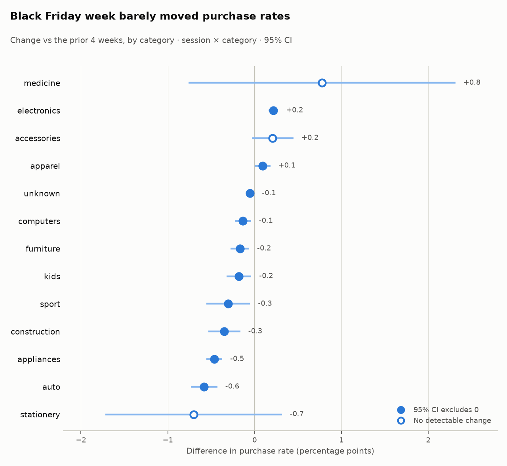
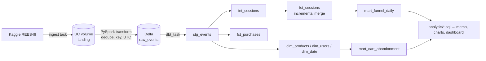

# Modern E-Commerce Analytics Platform

[](https://github.com/DiazSk/Modern-E-commerce-Analytics-Platform/actions/workflows/ci.yml?query=branch%3Amain+event%3Apush)

**Black Friday week sent more shoppers to the cart.** 11.7% of sessions reached the cart, compared with 9.2% in the four weeks before: **+2.5 pp** (95% CI +2.46 to +2.55). Purchase rate rose from 5.25% to 5.60% (+0.36 pp, CI +0.32 to +0.39).

**And a four-day tracking gap nearly told the opposite story.** Nov 15 logged 468,262 carts and zero purchases. With Nov 14–17 left in the baseline, every headline result reverses (cart reach −1.7 pp), and each still looks statistically solid. The analysis finds the gap, measures how much it matters, and excludes it. A dbt test now warns if one ever happens again.

📊 [Interactive dashboard](https://diazsk.github.io/Modern-E-commerce-Analytics-Platform/) · 📝 [Findings memo](analysis/findings.md) · 🔁 [How this project evolved](MIGRATION.md)

An end-to-end pipeline on **109.8M real e-commerce events** (REES46, Oct–Nov 2019),
running entirely on **Databricks Free Edition**: ingestion from Kaggle, PySpark
into Delta Lake, dbt models and tests, and an analysis layer that reports effect
sizes with confidence intervals.



## Architecture


```mermaid
flowchart LR
    K[Kaggle REES46] -->|ingest task| V[(UC volume<br/>landing)]
    V -->|PySpark transform<br/>dedupe, key, UTC| R[(Delta<br/>raw_events)]
    R -->|dbt_task| S[stg_events]
    S --> I[int_sessions] --> F[fct_sessions<br/>incremental merge]
    S --> P[fct_purchases]
    S --> D[dim_products / dim_users / dim_date]
    F --> M1[mart_funnel_daily]
    D --> M2[mart_cart_abandonment]
    M1 & M2 --> A[analysis/*.sql → memo, charts, dashboard]
```

The pipeline is one Databricks Workflows job, `rees46_pipeline`, defined as code in a
Databricks Asset Bundle (`databricks.yml`, `resources/rees46.yml`). It's a
**historical backfill replay**, triggered once per month, not a live feed.
Re-running a month replaces it, and Delta rejects any row dated outside that month.

## Data model

| Model | Grain | Notes |
|---|---|---|
| `raw_events` | event | Delta, partitioned by `event_date`, exact duplicates removed |
| `fct_sessions` | session | incremental merge; recomputes every session with events in the loaded month |
| `fct_purchases` | purchase event | the source has no order IDs |
| `dim_products` | product | latest attributes, price quartile within category |
| `dim_users`, `dim_date` | user, day | |
| `mart_funnel_daily` | session start date × category | a stage counts if the session reached it or any later stage |
| `mart_cart_abandonment` | category × price band × week | one row per product carted in a session |

## Analysis

`analysis/queries/*.sql` answers two questions. Where do shoppers drop off in
view → cart → purchase, and did Black Friday week change it? And does price
drive cart abandonment within a category? Every comparison is a difference in
proportions with a 95% CI. `analysis/run_queries.py` runs the queries on the
SQL warehouse through the Databricks CLI and commits only aggregates:
`analysis/results/` holds the query outputs and `analysis/extracts/` the
dashboard data. `analysis/build_site.py` turns them into the
[dashboard](https://diazsk.github.io/Modern-E-commerce-Analytics-Platform/), a
static page in `docs/` whose explorer can put the tracking gap back in.

## Quality

- **pytest:** covers the transform (dedupe, UTC, null-safe keys, month guard), the
  job tasks, the analysis runner and the dashboard build.
- **dbt:** unique, not-null and relationships tests, 3 unit tests, and singular
  tests: funnel monotonicity, unique mart grains, no `'None'` strings,
  `fct_sessions` consistent with a from-scratch aggregation, and a warning for
  any day with carts but no purchases. The from-scratch consistency test caught
  a real-data issue: REES46 session IDs can span weeks.
- **CI** (no cloud credentials): lint, pytest, and a two-month dbt build on local
  Spark + Delta over a **synthetic** fixture, because the dataset's license
  doesn't allow redistributing rows.

## Run it

```bash
brew tap databricks/tap && brew install databricks
databricks auth login --host <your-workspace-url>
databricks secrets create-scope rees46
databricks secrets put-secret rees46 kaggle_username
databricks secrets put-secret rees46 kaggle_key
databricks bundle deploy
databricks bundle run rees46_pipeline --params month=2019-10
databricks bundle run rees46_pipeline --params month=2019-11
python analysis/run_queries.py && python analysis/make_charts.py && python analysis/build_site.py
```

## Tests

Local Spark + Delta (Java 17), no Databricks account needed:

```bash
pip install pyspark==3.5.3 delta-spark==3.2.1 pytest "dbt-core==1.12.5" "dbt-spark[session]==1.11.0"
pytest -q
bash ci/run_dbt_ci.sh
```

## Data and limitations

[REES46 "eCommerce behavior data from multi category store"](https://www.kaggle.com/datasets/mkechinov/ecommerce-behavior-data-from-multi-category-store)
(data © original authors; only aggregates are published here). It covers one store
and two months of 2019. There are no order IDs or demographics, session IDs can
span weeks, and Nov 14–17 has a tracking gap. See the memo's caveats.

The first version of this project (synthetic data on Postgres) is at tag
[`v1-postgres-synthetic`](https://github.com/DiazSk/Modern-E-commerce-Analytics-Platform/tree/v1-postgres-synthetic).

## Contact

**Zaid Shaikh** · [GitHub](https://github.com/DiazSk) · [LinkedIn](https://www.linkedin.com/in/zaidshaikhengineer/)
