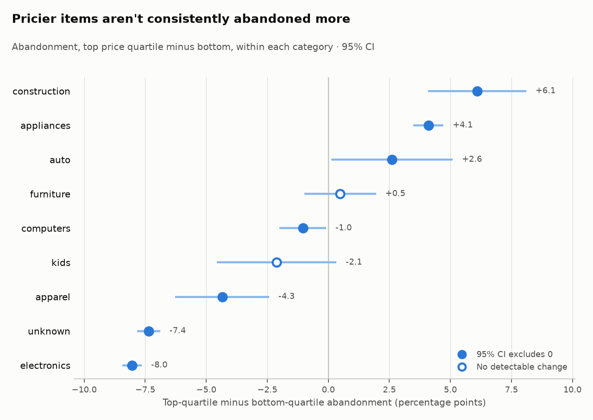

# Where do shoppers drop off, and did Black Friday change it?

*REES46 multi-category store, Oct–Nov 2019 · 109.8M events · 23.0M sessions · 1.66M purchases · 5.3M shoppers*

Interactive version: [the dashboard](https://diazsk.github.io/ecommerce-funnel-lakehouse/). It includes a toggle that puts the tracking gap back in.

## TL;DR
- **Black Friday week sent more shoppers to the cart.** 11.7% of sessions reached the cart, compared with 9.2% in the four weeks before: **+2.5 pp** (95% CI +2.46 to +2.55). Purchase rate rose from 5.25% to 5.60% (+0.36 pp, CI +0.32 to +0.39).
- **A four-day tracking gap nearly told the opposite story.** Nov 15 recorded 468,262 carts and zero purchases. Left in the baseline, Nov 14–17 flip the headline to cart reach **−1.7 pp** and cart abandonment **−12.3 pp**.
- **The lift was broad but small.** Purchase rate rose significantly in 8 of 13 categories. The largest rise was in electronics (+0.49 pp, CI +0.44 to +0.55). None fell by a detectable amount.
- **Pricier items are usually abandoned less, not more.** Within a category, the priciest quarter of products is abandoned less than the cheapest quarter in 5 of 8 categories (electronics −14.7 pp, CI −15.2 to −14.3). Construction (+5.8 pp) and appliances (+2.9 pp) are the exceptions.
- **Once shoppers carted, Black Friday didn't change whether they bought.** Cart abandonment was 54.3%, compared with 53.9% before (+0.45 pp, CI +0.25 to +0.66).

## 1. The funnel, and Black Friday week
The baseline is the four weeks before Black Friday week, Oct 28 – Nov 24, minus Nov 14–17 (see section 3). Black Friday week is Nov 25–30.

| Share of sessions that… | Baseline | Black Friday week | Difference (95% CI) |
|---|---|---|---|
| reached the cart | 9.21% | 11.71% | +2.50 pp (+2.46 to +2.55) |
| made a purchase | 5.25% | 5.60% | +0.36 pp (+0.32 to +0.39) |
| sessions | 9,199,507 | 2,390,542 | |

Cart reach rose by about a quarter in relative terms, while purchase rate rose by about 7%. Most of the Black Friday gain came from getting shoppers to the cart; the extra carts turned into purchases at roughly the usual rate. For a merchandising or marketing lead, the week's leverage was at the top of the funnel.

Purchase rate rose in 8 of 13 categories: electronics (+0.49 pp), appliances (+0.38), accessories (+0.29), computers (+0.28), construction (+0.20), furniture (+0.19), apparel (+0.19) and unknown (+0.17). "Unknown" means products with no category code. Five categories show **no detectable change** because their CIs cross 0: sport (+0.04 pp, CI −0.22 to +0.30), kids (+0.02, CI −0.12 to +0.17) and auto (−0.00, CI −0.16 to +0.15), plus two small ones with wide intervals, medicine (+1.45, CI −0.11 to +3.02) and stationery (−1.02, CI −2.09 to +0.06).

*Source: `queries/q1_overall_black_friday.sql`, `queries/q1_category_black_friday.sql`*

## 2. Cart abandonment and price
A carted item counts as abandoned if the session that carted it never buys it. Price bands are quartiles of each product's price within its own category. Comparing inside a category stops a category's mix from looking like a price effect. The figures cover Oct 1 – Nov 30, minus Nov 14–17.

Eight categories have at least 1,000 carted items in both their priciest and cheapest quartile. In 5 of them the priciest quartile is abandoned *less*: electronics −14.7 pp (CI −15.2 to −14.3), unknown −13.2 (−13.8 to −12.6), apparel −7.6 (−10.4 to −4.7), computers −7.5 (−8.8 to −6.3) and kids −4.7 (−7.9 to −1.5). Only in construction (+5.8 pp, CI +2.9 to +8.6) and appliances (+2.9, CI +2.0 to +3.8) is the priciest quartile abandoned *more*. Furniture shows no detectable difference (+0.7, CI −1.8 to +3.2). In electronics the outlier is the cheapest quartile: 61.8% of those items are abandoned, compared with 45–48% in each of the other three. So price alone doesn't explain abandonment. Where it matters, it points in opposite directions in different categories.

Black Friday week barely moved abandonment: 54.3%, compared with 53.9% before (+0.45 pp, CI +0.25 to +0.66; 318,147 vs 795,117 carted items). The difference is statistically detectable but too small to matter commercially.

*Source: `queries/q2_abandonment_by_band.sql`, `queries/q2_band_contrast.sql`, `queries/q2_abandonment_black_friday.sql`*

## 3. The Nov 14–17 tracking gap
In the week before, the store logged about 1.9–2.0M events, 68–75k carts and 22–26k purchases a day. Then, from Nov 14 to Nov 17:

| Date | Events | Carts | Purchases |
|---|---|---|---|
| Nov 14 | 3,064,736 | 165,541 | 22,124 |
| Nov 15 | 6,205,340 | 468,262 | **0** |
| Nov 16 | 6,488,924 | 392,878 | 68,247 |
| Nov 17 | 6,379,921 | 411,604 | 185,195 |
| Nov 18 | 2,018,957 | 80,682 | 28,537 |

A day with 468,262 carts and no purchases is a recording failure, not shopper behaviour. Nov 17's 185,195 purchases, about eight times a normal day, look like a backlog being written late. The traffic surge itself may be real, but this data can't separate real traffic from logging problems. So these four days are excluded from every baseline in this memo.

What leaving them in would have said:

| Metric (Black Friday week vs baseline) | Gap excluded | Gap included |
|---|---|---|
| Cart reach | +2.50 pp (+2.46 to +2.55) | −1.72 pp (−1.76 to −1.67) |
| Purchase rate | +0.36 pp (+0.32 to +0.39) | −0.08 pp (−0.11 to −0.04) |
| Cart abandonment | +0.45 pp (+0.25 to +0.66) | −12.34 pp (−12.53 to −12.16) |

All three conclusions reverse, and each looks statistically solid. The confidence intervals only measure sampling noise, so they can't catch a broken input. A dbt test, `assert_no_day_with_carts_but_no_purchases`, now warns on any day with at least 1,000 carts and no purchases.

*Source: `queries/q0_anomaly_daily.sql`, `queries/q3_anomaly_impact.sql`*

## 4. Recommendations
These are observational results, so each recommendation is a test to run, not a proven cause.
- **Test where Black Friday budget goes.** Cart reach rose 2.5 pp while abandonment moved only 0.45 pp. A/B test top-of-funnel levers (promoted listings, price badges on product pages) against checkout incentives, and measure the cost of each extra cart.
- **Test financing or delivery-cost clarity on expensive construction and appliance items.** These are the two categories where the priciest quartile is abandoned more (+5.8 pp and +2.9 pp). An A/B test of installment options or an up-front delivery quote at cart would show whether cost is what stops shoppers.
- **Test how cheap electronics are presented at checkout.** The cheapest electronics quartile is abandoned at 61.8%, compared with 45–48% for the rest. Try offering these items as add-ons to a larger order rather than standalone purchases.
- **For the data team:** alert on funnel-shape breaks, not just row counts. The four gap days had plenty of rows; their shape was what was wrong.

## 5. Caveats
- **"Session" is the dataset's session ID, and it can span weeks.** 0.28% of sessions end on a later calendar day than they start, 0.035% end 7+ calendar days later, and the longest spans 60 days. The median session lasts 61 seconds (`queries/q0_data_profile.sql`). Sessions are dated by their first event.
- **There are no order IDs.** "Purchases" are purchase events.
- **Price bands use each product's latest price,** which may be a Black Friday price.
- **Units aren't independent.** In the category comparison, one session can count in several categories, so those CIs are optimistic. The overall comparison is at session level.
- **This is observational data.** Black Friday week also differs in traffic mix, so the differences are associations, not the effect of a promotion.
- **Scope:** one store, two months of 2019. The CI pipeline runs on synthetic data; these numbers come from the real dataset in Databricks.

## Method
The comparisons are differences in proportions with 95% Wald confidence intervals: diff ± 1.96·√(p₁(1−p₁)/n₁ + p₀(1−p₀)/n₀). Groups under 1,000 observations in either period or band are excluded from the category and price-band comparisons. Everything is reproducible with `python analysis/run_queries.py`.
